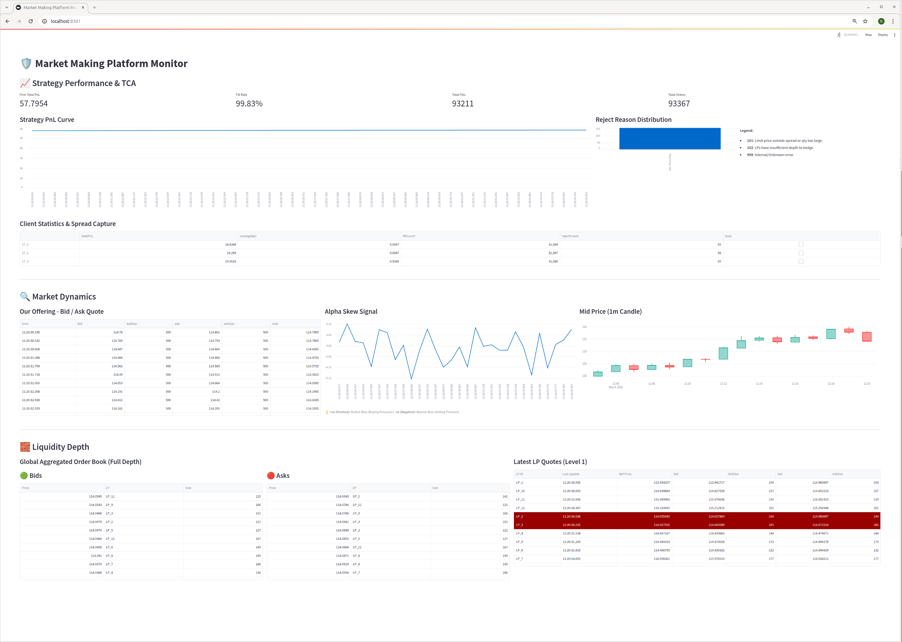
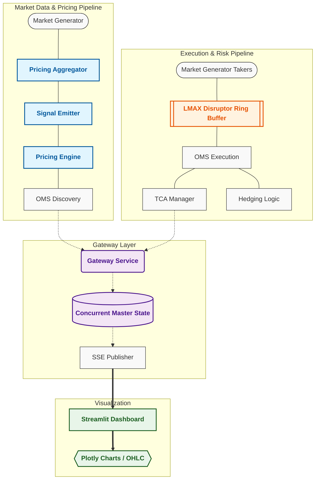

# 🛡️ High-Frequency Market Making & Pricing Engine

A low-latency market-making simulator built with **Java 21**, the **LMAX Disruptor**, **Javalin** and **Streamlit** . This platform simulates the complete lifecycle of a quantitative trading operation—from synthetic liquidity generation to toxic flow defense and real-time TCA (Transaction Cost Analysis).

## 🖥️ Platform Monitor
The Streamlit-based dashboard provides a high-fidelity view of the engine's internal state, updated in real-time via Server-Sent Events (SSE).


### UI Component Breakdown
The dashboard is divided into four critical monitoring zones:

*   **Strategy Performance & TCA**: 
    *   **KPI Tiles**: Real-time display of **Net PnL**, **Fill Rate %**, **Total Fills**, and **Total Orders** [source: 1].
    *   **PnL Curve**: Visualizes cumulative performance and strategy stability [source: 1].
    *   **Reject Reason Distribution**: A categorical breakdown of failed orders (e.g., Price Improvement fails, Latency-induced staling) [source: 1].
*   **Market Dynamics**:
    *   **Our Offering**: The live Bid/Ask quotes currently being published by the Pricing Engine [source: 1].
    *   **Alpha Skew Signal**: A high-frequency line chart showing the directional bias (Bullish/Bearish) generated by the Signal Emitter [source: 1].
    *   **Mid-Price (1m Candle)**: Real-time OHLC candlestick chart aggregating market mid-prices [source: 1].
*   **Liquidity Depth**:
    *   **Global Aggregated Order Book**: A full-depth view of the market, consolidating quotes from all 12+ simulated Liquidity Providers [source: 1].
*   **Latest LP Quotes**: 
    *   A level-1 heatmap showing the most recent Bid/Ask spreads and liquidity updates from individual providers [source: 1].

---

## 🏗️ System Architecture

The platform is architected with a strict separation of concerns between market data propagation and the order execution pipeline to ensure deterministic performance.



### 1. Market Data & Pricing Pipeline (Northbound)
*   **Market Generator**: Simulates 12+ Liquidity Providers (LPs) generating thousands of price updates per second[cite: 1].
*   **Pricing Aggregator**: Consolidates fragmented LP quotes into a unified Top-of-Book and Full-Depth view[cite: 1].
*   **Signal Emitter**: Analyzes order book imbalance and price velocity to generate an **Alpha Skew** (Bullish/Bearish bias)[cite: 1].
*   **Pricing Engine**: Combines the Aggregated Price with the Alpha Skew and a configurable `MIN_PROFIT_MARGIN` to produce live Bid/Ask quotes[cite: 1].

### 2. Execution & Risk Pipeline (Southbound)
*   **Market Generator (Takers)**: Simulates 15+ Liquidity Takers (LTs) attacking MM quotes based on premium and latency[cite: 1].
*   **Disruptor (Ring Buffer)**: Acts as the high-speed sequencer, ensuring all trade attempts are processed in strict temporal order without thread contention[cite: 1].
*   **OMS (Order Management System)**: Validates trades against the live book, executes fills, and triggers immediate hedging logic[cite: 1].
*   **TCA Manager**: Calculates real-time metrics including **Fill Rate**, **Toxicity**, and **Total PnL**[cite: 1].

---

## 📊 Market Microstructure Scenarios

The engine supports multiple deployment profiles to simulate different market conditions and hardware optimizations[cite: 1]. Use these to test the robustness of the pricing logic and JVM stability.

| Scenario | Profile Name | Key Dynamics | Primary Objective |
| :--- | :--- | :--- | :--- |
| **A** | **Normal Run** | Default liquidity parameters and taker behavior[cite: 1]. | Establish baseline performance and stable PnL tracking[cite: 1]. |
| **B** | **Toxic Arbitrage** | High Volatility ($0.08$) + $15$ Aggressive Takers[cite: 1]. | Observe "Stale Quote Arbitrage" and the impact of adverse selection[cite: 1]. |
| **C** | **High Rejection** | Ultra-low Profit Margin + Low Premium Ratio. | Observe high order rejection rates due to "Price Improvement" failures[cite: 1]. |
| **D** | **High Performance** | JVM Pinned ($-Xms4g$), NUMA aware, & Generative ZGC. | Demonstrate sub-1ms GC pauses and maximized tick-to-trade throughput[cite: 1]. |

> **Note**: Scenarios B, C, and D are triggered by passing specific compose files using the `-f` flag during startup[cite: 1].


## 🛠️ Technology Stack

* **Backend**: Java 21+ utilizing **Generative ZGC** for sub-millisecond GC pauses and **Virtual Threads** for high-concurrency SSE broadcasting.
* **Messaging**: **LMAX Disruptor** (Ring Buffer) for lock-free, deterministic event sequencing in the execution pipeline[cite: 1].
* **API Gateway**: **Javalin** providing a lightweight SSE (Server-Sent Events) interface for real-time data streaming[cite: 1].
* **Frontend**: **Python 3.12** using **Streamlit** for the dashboard and **Plotly** for high-frequency OHLC and PnL rendering[cite: 1].
* **Containerization**: **Docker** & **Docker Compose** for consistent environment orchestration across deployment profiles.

## 📋 Prerequisites

Before running the simulation, ensure you have the following installed:

1. **Docker & Docker Compose**:
   * [Install Docker Desktop (Windows/Mac/Linux)](https://docs.docker.com/get-docker/)
   * Verify via `docker compose version` in your terminal.

2. **Java Mission Control (Optional)**:
   * Recommended for monitoring Scenario D's performance via JMX on port `9010`.
   * [Download JMC](https://www.oracle.com/java/technologies/jdk-mission-control-downloads.html)

3. **Resources (Optional)**:
   * Minimum **4GB RAM** allocated to Docker to support the High-Performance JVM profile (Scenario D).

## ⚡ Technical Highlights

| Component | Technology | Performance Benefit |
| :--- | :--- | :--- |
| **Engine Runtime** | Java 21 (ZGC) | Generative ZGC keeps pause times < 1ms[cite: 1]. |
| **Messaging** | LMAX Disruptor | Mechanical sympathy; avoids traditional lock overhead[cite: 1]. |
| **Javalin I/O** | Virtual Threads | Scales to hundreds of UI sessions without thread starvation[cite: 1]. |
| **Frontend** | Streamlit + Plotly | Optimized Pandas rendering with `ignore_index=True` for stability[cite: 1]. |

## 🚀 Getting Started

```bash
# Scenario A - Start the standard simulation
docker-compose up --build

# Scenario B - 'Toxic Arbitrage' stress-test scenario
docker compose -f profiles/docker-compose-toxic.yml --project-directory . up --build -d

# Scenario C - 'High Rejection' stress-test scenario
docker compose -f profiles/docker-compose-rejection.yml --project-directory . up --build -d
```
### 🔍 Verifying the Deployment

After running the `docker compose` command, you should see the following sequence in your terminal:

1. **Build Phase**: Docker will build the Backend (Java 21) and Frontend (Python 3.12) images. If you see `CACHED`, Docker is reusing layers from previous builds.
2. **Network Creation**: A bridge network named `marketmakingpricingengine_default` is created to allow inter-container communication[cite: 1].
3. **Container Startup**: Two containers will transition to the `Started` state:
    * `mm-gateway-backend`: The Java trading engine[cite: 1].
    * `mm-gateway-ui`: The Streamlit dashboard[cite: 1].

**Terminal Success Output:**
```text
 ✔ Network marketmakingpricingengine_default Created
 ✔ Container mm-gateway-backend               Started
 ✔ Container mm-gateway-ui                    Started
```

### 🙏 Acknowledgments
Developed in collaboration with **Gemini (Google AI)** for architecture design and performance optimization.

